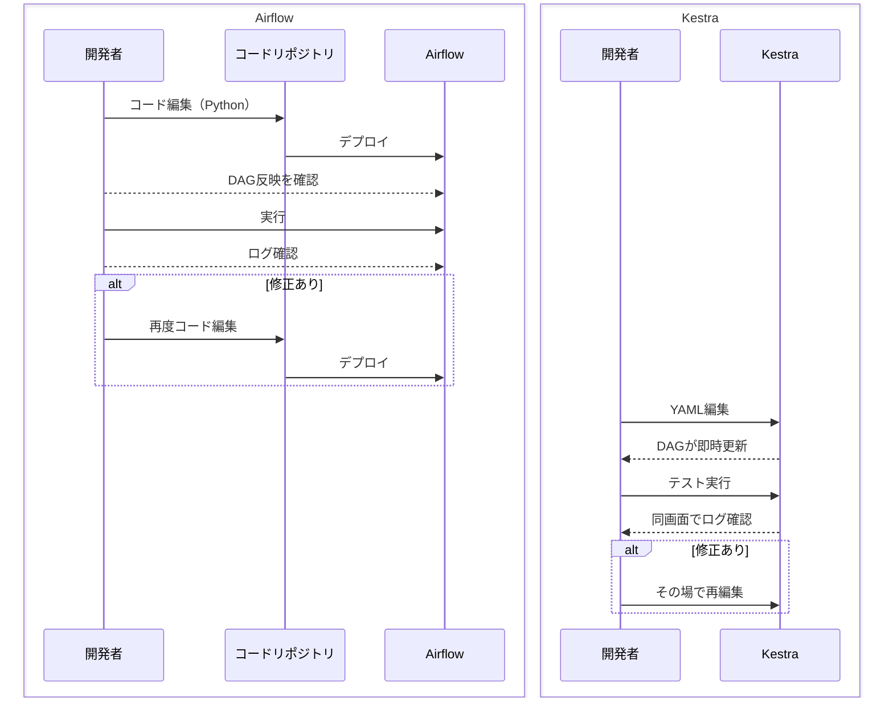

## 1. はじめに

データパイプラインや ETL ジョブの自動化といえば、長らく ** Apache Airflow ** が事実上の標準ツールとして使われてきました。  
私自身も日常的に Airflow を使い、数百本規模の DAG を開発運用してきましたが、その中でいくつかの課題を感じていました。

- **DAG ファイル（python）の肥大化と保守負荷**  
  Python コード内で依存関係やパラメータを管理していると、ジョブが増えるにつれてファイルが複雑化し、レビューや修正が大変になる。

- **UI とコードの行き来**  
  DAG の可視化や実行状況の確認は UI からできますが、編集や修正は必ず Python コードに戻る必要がある。  
  小さな修正でもコード → デプロイ →UI 反映という手間がかかる。

- **非エンジニアとのコラボレーションの難しさ**  
  ビジネスアナリストやデータサイエンティストがワークフローの変更に関わりたい場合でも、Python コードの理解が必要になり、エンジニアが介在しないと進まない。

これらは**「Airflow の宿命」**のように感じていたのですが、最近登場した**Kestra**というオープンソースのワークフローオーケストレーターに触れてみると、 「この課題、ほとんど解消できるのでは？」と思わせる体験がありました。

本記事では、Airflow を使い慣れた私が Kestra を実際に試し、**ワークフロー開発がどう変わるか**を具体的に比較します。  
「Airflow から乗り換えるべきか？」「Kestra はどんな場面で有効か？」の判断材料になることを目指します。

## 2. ツール概要（Airflow と Kestra）

### Apache Airflow

**Apache Airflow** は、Python でワークフロー（DAG: Directed Acyclic Graph）を定義し、スケジュールや依存関係に基づいてジョブを実行するオープンソースのオーケストレーションツールです。

- **開発スタイル**：Python コードで DAG・タスク・依存関係を記述
- **実行基盤**：スケジューラ＋ Executor（Celery/Kubernetes など）で分散実行
- **UI**：DAG 構造や実行履歴を可視化、タスクの手動実行や再実行が可能
- **強み**：Python で書けるので機能を自由に追加しやすい、利用者が多く情報が豊富、既製の部品（Operator）がたくさんある

Airflow は柔軟性が高く、複雑な処理やカスタムロジックを実装するのに向いていますが、「Python 前提」であるため非エンジニアが直接編集するのは難しく、環境構築や運用負荷が比較的高い傾向があります。

### Kestra

**Kestra** は、YAML による宣言型のワークフロー定義と、統合された UI を備えた次世代のオーケストレーションプラットフォームです。  
クラウドネイティブ設計で、バッチ処理やイベントをきっかけにした処理、定期実行を簡単に作れます。

- **開発スタイル**：YAML でフローとタスクを宣言的に記述（UI から編集可能）
- **実行基盤**：分散処理できる仕組みを使っており、大きなデータや大量の作業も効率よくこなせる
- **UI**：コードエディタ・自動補完・構文チェック・ライブ DAG ビューを搭載
- **強み**：非エンジニアも UI からワークフロー編集可能、イベント駆動やスケジュール実行の設定がシンプル、豊富なプラグインがある

特にトリガー設定の機能は Kestra を採用するメリットのひとつです。  
スケジュール（毎日〇時など）やイベント（ファイル到着、Webhook、別フローの完了など）をきっかけにした実行を、同じ書き方で簡単に作れます。  
Airflow でも同様のことは可能ですが、イベント駆動の場合は`Sensor`の設定が必要になり、構成が複雑になりがちです。  
Kestra では標準機能としてトリガーが用意されており、YAML に 1〜2 行追加するだけで設定できます。

### 共通点と相違点

| 項目         | Airflow                              | Kestra                                 |
| ------------ | ------------------------------------ | -------------------------------------- |
| 定義方法     | Python コード                        | YAML（宣言型）＋ UI                    |
| 実行トリガー | スケジュール中心、イベントも可       | スケジュール＋イベントドリブン標準対応 |
| 実行基盤     | Composer や Celery/K8s Executor など | Kubernetes 、Kafka/Elastic 活用        |
| UI の役割    | 監視・実行                           | 編集・補完・監視まで一元化             |
| チーム適合性 | 開発者中心                           | 非エンジニア含めた幅広いユーザー       |

## 3. 同じワークフローを作って実装比較してみる

ここでは、次のようなシンプルなデータパイプラインを例にして、Airflow と Kestra での実装方法を比較します。

**ワークフロー要件**

1. データを取得する
2. 取得データを加工する
3. 加工したデータを保存する

---

### Airflow での実装（Python）

```python
from airflow import DAG
from airflow.operators.bash import BashOperator
from datetime import datetime

with DAG(
    dag_id="sample_pipeline",
    start_date=datetime(2024, 1, 1),
    schedule_interval="@daily",
    catchup=False
) as dag:
    fetch_data = BashOperator(
        task_id="fetch_data",
        bash_command="echo 'Fetching data...'"
    )

    process_data = BashOperator(
        task_id="process_data",
        bash_command="echo 'Processing data...'"
    )

    save_data = BashOperator(
        task_id="save_data",
        bash_command="echo 'Saving data...'"
    )

    fetch_data >> process_data >> save_data
```

### Kestra での実装（YAML）

```yaml
id: sample_pipeline
namespace: default
tasks:
  - id: fetch_data
    type: io.kestra.core.tasks.scripts.Bash
    commands:
      - echo "Fetching data..."

  - id: process_data
    type: io.kestra.core.tasks.scripts.Bash
    commands:
      - echo "Processing data..."

  - id: save_data
    type: io.kestra.core.tasks.scripts.Bash
    commands:
      - echo "Saving data..."
```

### 比較ポイント

| 項目           | Airflow                                | Kestra                               |
| -------------- | -------------------------------------- | ------------------------------------ |
| 記述言語       | Python                                 | YAML                                 |
| 依存関係の指定 | 明示的に`>>`や`<<`で記述               | 順番に書くだけで自動設定             |
| UI での編集    | 不可（コード変更 → デプロイ）          | 可（UI 編集 → 即時反映）             |
| コード量       | やや多め                               | 少ない、宣言的記述で完結             |
| 初期学習コスト | Python 文法や Airflow API の理解が必要 | YAML の書き方と type だけ覚えれば OK |

Kestra はシンプルにフローを定義するだけで動き、UI から直接編集できるため、**素早くワークフローを作る**のに向いています。  
一方 Airflow はセットアップやフローの修正にはコード編集とデプロイなどが必要になります。

## 4. 開発体験の違い

同じワークフローを実装しても、「作るとき」「試すとき」「運用するとき」の感覚は Airflow と Kestra で大きく異なります。

### 開発フローの概要（Airflow と Kestra の比較）



### 運用・開発面での特徴

- **Airflow の場合**

  - 新しい処理を作る際、多くは既存の Operator を使うか、自作の Python コードを書く必要があります。
  - チーム開発では Git を通じてコードレビューし、デプロイして反映するのが基本フローです。
  - 柔軟性は高い反面、非エンジニアが直接運用に関わるのは難しいです。

- **Kestra の場合**
  - 「HTTP リクエスト」「ファイルのアップロード」「SQL 実行」「クラウドサービス連携」など、多くの処理が**タスクタイプ**としてあらかじめ用意されています。
  - タスクタイプを選んでパラメータを設定するだけで動くため、コードを書かずに多くのワークフローを組めます。
  - 非エンジニアでも UI から設定変更や実行が可能で、Git 連携でバージョン管理できるみたいです。

Kestra は、**まずは UI と既存のタスクタイプで素早く構築 → 必要に応じてコード追加**という二段構えができるため、PoC から本番運用までの移行がスムーズです。一方 Airflow は、初期からコード前提の設計になるため、チーム構成やスキルセットに依存しやすい傾向があります。

## 6. 導入判断ポイント

Airflow と Kestra のどちらを選ぶべきかは、プロジェクトの性質やチームの構成によって変わります。  
以下、導入・移行の方向性を検討するための軸を考えました。

### 技術選定の比較軸

- **チーム構成**

  - Python に慣れたエンジニア中心 → Airflow の柔軟性が活きる
  - 非エンジニアもワークフロー構築に関わる → Kestra の UI 編集・タスクタイプの多さが有効

- **実行環境**

  - 既に Airflow 環境があり安定運用している → 継続利用や段階的移行が無難
  - Kubernetes 環境が前提 → Kestra のネイティブ対応が有利

- **ワークフローの性質**

  - 高度な条件分岐や複雑な依存関係 → Airflow が有利
  - バッチ・イベント駆動・スケジュールを同じ仕組みで簡単に作りたい → Kestra が有利

- **開発スピード**

  - コードレビュー・テストをしっかり行う長期プロジェクト → Airflow
  - PoC や短期での構築・改善を繰り返す案件 → Kestra

- **メンテナンス性**
  - コードで一元管理し、CI/CD に完全統合したい → Airflow
  - UI 編集と Git 連携の両立で柔軟に運用したい → Kestra

## 7. まとめ

Airflow と Kestra は、どちらも優れたワークフローオーケストレーションツールですが、設計思想と開発体験は大きく異なります。

- **Airflow**

  - Python で柔軟な DAG を構築でき、複雑な依存関係や高度なロジックを実装するのに強い
  - コードベースでの管理や既存の CI/CD フローと相性が良い
  - ただし、非エンジニアが直接関わるにはハードルが高く、試行サイクルはやや長い

- **Kestra**
  - YAML ＋ UI でシンプルに構築でき、トリガーやタスクタイプが豊富に揃っている
  - UI 編集 → 即時反映 → テスト実行 → ログ確認までが一画面で完結
  - 非エンジニアを含む多様なチームでの開発・運用に向いている

**結論**：

- **コード主体・柔軟性重視**なら Airflow
- **スピード・シンプルさ・多様なメンバーでの運用重視**なら Kestra

実務では、両者を使い分けるハイブリッドも選択肢です。たとえば、既存のバッチ処理は Airflow で運用し、新規のイベント駆動型ワークフローは Kestra で素早く立ち上げる、といった形です。

この記事が、Airflow 経験者が Kestra を検討する際の技術的判断材料になれば幸いです。
